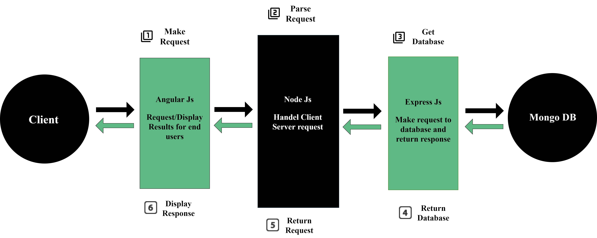

# 

Demonstrate the ability of MEAN Stack to create a simple User Application for CRUD operations.

*Check [mean-github](https://github.com/meanjs/mean) - The Open-Source Full-Stack Solution For MEAN Applications.*

## Introduction

MEAN is a set of Open Source components that together, provide an end-to-end framework for building dynamic web applications; starting from the top (code running in the browser) to the bottom (database). The stack is made up of:

- **M**ongoDB : Document database – used by your back-end application to store its data as JSON (JavaScript Object Notation) documents
- **E**xpress (sometimes referred to as Express.js): Back-end web application framework running on top of Node.js
- **A**ngular (formerly Angular.js): Front-end web app framework; runs your JavaScript code in the user's browser, allowing your application UI to be dynamic
- **N**ode.js : JavaScript runtime environment – lets you implement your application back-end in JavaScript

# 

## Getting Started

```
$ git clone https://github.com/amromran102/bmg.git
```

## Run with Docker

The repo contains a docker-compose.yml file, that orchestrates the build of docker images for running the applicatiton.

Install [docker](https://docs.docker.com/get-docker/) and follow the next steps:

#### Verify that Docker is installed
```
$ docker  -v
Docker version 19.03.13, build 4484c46d9d

$ docker-compose -v
docker-compose version 1.27.4, build 40524192
```

#### Build the Application with Docker Compose

Navigate to the project folder and execute docker-compose 
```
$ cd bmg
$ docker-compose up --build
```
As a result of a sucessfull compiling you should see the following in your console:
```
Server has been started at port:3000
...
MongoDB is connected at port 27017
...
** Angular Live Development Server is listening on 0.0.0.0:4200, open your browser on http://localhost:4200/ **
```
##### Navigate to the [website](http://localhost:4200/)

## Backup and Restore MongoDB running in a Docker Container
Now the challenging part is to backup mongodb running in a docker container as part of the application stack

To make it simple run mongodump.sh attached in the project:
```
$ bash mongodump.sh
```
Even better is doing database backups on a scheduled basis in an automated way!.
Execute cronjob.sh to run backup as part of cronjob.
```
$ bash cronjob.sh
```

#### How does the Backup work in the background?
In the dockercompose file, a docker volume is attached between mongodb container and local machine. \
By executing mongodump.sh script, mongodump is executed to take backup in a specified directory that is linked to the docker volume. \
In the current directory, a folder "db_backup" is created where databases backup exsists in a *.bson formate. 

---
**NOTE**:
It is recommended to keep your database backups in a remote destination, ex: AWS S3 Bucket.

---

## Restore MongoDB the easy way!

Restorating MongoDB is an easy task, specially with Docker Volume in place.
- Copy mongo databases backups into the specified volume, and build containers again with Docker Compose.

That's it!. MongoDB container will start the databases from *.bson files!.

## Restore MongoDB with mongorestore

DB backup files (*.bson) must be copied to the container before executing mongorestore to restore database.

Simply execute $ docker cp cmd to copy files from host to docker container
```
$ docker cp [OPTIONS] SRC_PATH|- CONTAINER:DEST_PATH
$ docker cp db_backup/. bmg_db:/data/db
```

Then, execute mongorestore on the container to restore database
```
$ docker exec -it <CONTAINER_NAME> <CMD>
$ docker exec -it bmg_db mongorestore data/db/userslist/*.bson
```
